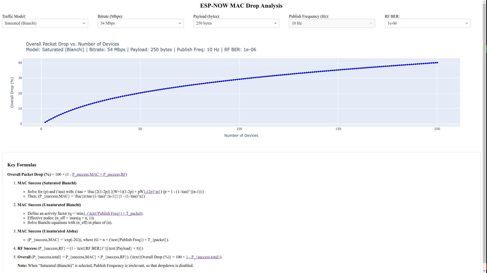

ESP-NOW MAC Drop Analysis Dashboard
===================================

This interactive web application models MAC-level packet drop probability for wireless communication using ESP-NOW over IEEE 802.11. It includes models for both saturated and unsaturated traffic conditions using the Bianchi model and Aloha approximation, with RF-level bit error probability factored in.

Features
--------

- Selectable Traffic Models:
  - Saturated (Bianchi)
  - Unsaturated (Bianchi)
  - Unsaturated (Aloha)

- Adjustable parameters:
  - Bitrate (1 to 54 Mbps)
  - Payload size (1 to 250 bytes)
  - Publish frequency (Hz) — disabled for saturated model
  - RF Bit Error Rate (BER)

- Real-time interactive graph of overall drop percentage vs. number of devices.
- Mathematical formula summary displayed for educational/reference use.

Models Implemented
------------------

1. Saturated Bianchi:
   Solves the classic Bianchi model with collision probabilities and contention backoff.

2. Unsaturated Bianchi:
   Extends the model by incorporating an activity factor based on publish rate.

3. Unsaturated Aloha:
   Simplified model using exponential approximation:
   P_success = exp(-2G)
   where G = n × pub_freq × T_packet

4. RF Success Probability:
   P_success_RF = (1 - BER)^(payload × 8)

5. Overall Drop:
   Drop(%) = 100 × [1 - (P_success_MAC × P_success_RF)]

Run Locally
-----------

Prerequisites:
- Python 3.7+
- Dash, Plotly, NumPy, SciPy

Install dependencies:
    pip install -r requirements.txt

Run the App:
    python espnow_mac_drop_analysis.py

Visit http://127.0.0.1:8050 in your browser.

Use Case
--------

Useful for analyzing:
- ESP-NOW based P2P communication systems
- MAC-level scalability for IoT/robotics devices
- Impact of RF BER and payload size on drop rates

License
-------

MIT License – Use freely with attribution.

Preview
-------

